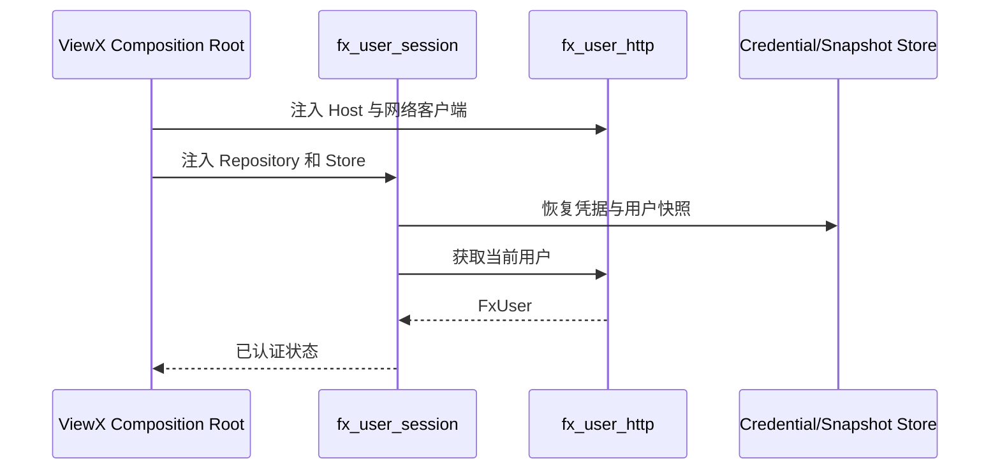
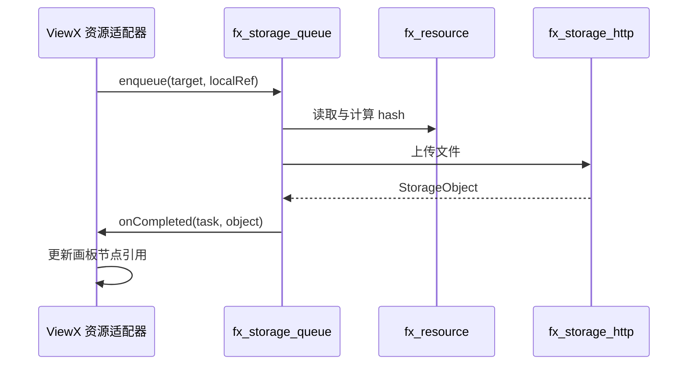
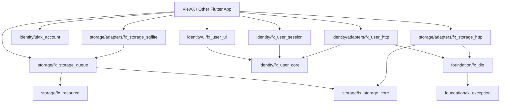

# FrameworkX SDK Foundation — 客户端设计报告

> 关联设计：[服务端设计](../server/design.md) | [边界分析](../analysis.md)

## 1. 目标

- 建立身份与存储两组可独立消费的 Dart/Flutter SDK 包；
- 统一认证会话、账号操作、云文件、额度和上传任务契约；
- 保留可复用 UI，但所有提交、路由和宿主副作用由外界注入；
- 消除 ViewX 对 FullStack 兄弟目录的运行时路径依赖；
- 让 ViewX 只保留产品组装、页面和画板资源回写逻辑。

## 2. 现状

身份模块已有良好基础：`fx_user_core` 不依赖 Flutter，`fx_user_session` 通过 Repository 与缓存端口工作，`fx_account` 的提交行为可以由宿主处理。

仍需修复：

- `fx_user_session` 同时包含会话编排与 HTTP 实现；
- 包内 `dependency_overrides` 反向指向 ViewX 的 `fx_dio`；
- `fx_user_ui` 与 ViewX 当前登录界面的职责尚未统一；
- 相同身份能力散落在 FullStack 与 ViewX 两个仓库。

存储模块当前混合度较高：

- `fx_resource` 基本具备独立包条件；
- `CloudStorageRepository` 是可复用端口，但 `HttpCloudStorageRepository` 依赖 `fn_app::AppServerHost`；
- 上传队列机制通用，但任务定位字段是 ViewX 画板语义；
- `presentation/asset` 下的页面和组件依赖 ViewX 的 `fn_core` 及画板跳转。

## 3. 模型与公开接口

### 3.1 身份域

```text
FxUser
FxIdentity
AuthCredential
AuthMethod
FxUserRepository
AuthCredentialStore
UserSnapshotStore
FxUserSession
```

`fx_user_core` 只使用 Dart SDK。认证类型和错误码由 `contracts/identity` 定义，Dart 包提供强类型映射。

### 3.2 存储域

```text
StorageObject
StorageQuota
StorageCategory
StoragePage
UploadRequest
UploadResult
UploadTask
UploadTaskState
StorageRepository
UploadTaskStore
LocalResourceStore
```

通用 `UploadTask` 使用业务无关目标：

```dart
final class UploadTarget {
  final String ownerId;
  final String namespace;
  final String targetId;
  final Map<String, String> metadata;
}
```

SDK 不解释 `metadata`，也不把它写入服务端文件协议。ViewX 可以在宿主适配器中把画板、节点和条目 ID 编码成自己的目标对象。

上传完成只通过回调或事件通知宿主：

```dart
typedef UploadCompleted = Future<void> Function(
  UploadTask task,
  StorageObject object,
);
```

### 3.3 HTTP 边界

`fx_user_http` 与 `fx_storage_http` 依赖通用网络抽象，不依赖 `fn_app`。Host、凭据和 URL 解析通过构造参数传入。

## 4. 核心流程

### 4.1 App 身份组装



### 4.2 通用上传与业务回写



401 只把任务置为 `paused`；SDK 不打开登录页。宿主恢复认证后调用 `resume(ownerId)`。

## 5. 项目结构与技术决策

### 5.1 Dart / Flutter Workspace 结构

客户端采用“**领域目录 → 能力分组 → 独立 package**”组织。包目录继续使用完整的 `fx_*` 名称，领域目录只做归属分组，不发布为 package。

```text
client/
├── pubspec.yaml                         # Dart Pub Workspace 成员声明
├── analysis_options.yaml                # 全 Workspace 统一静态规则
├── packages/
│   ├── foundation/                      # 至少被两个领域使用的稳定基础能力
│   │   ├── fx_exception/                # 通用异常分类与错误上下文
│   │   └── fx_dio/                      # 多 Host、认证注入与网络结果适配
│   │
│   ├── identity/                        # 身份、用户、会话和账号交互域
│   │   ├── fx_user_core/                # 纯 Dart 用户模型、身份模型与 Repository 端口
│   │   ├── fx_user_session/             # 会话状态、恢复、失效和持久化编排
│   │   ├── adapters/
│   │   │   └── fx_user_http/            # 用户与认证 HTTP Repository
│   │   └── ui/
│   │       ├── fx_user_ui/              # 可配置登录、注册与三方认证 UI
│   │       └── fx_account/              # 账号资料、安全操作和自有 l10n
│   │
│   └── storage/                         # 本地资源、云文件与上传生命周期域
│       ├── fx_resource/                 # 本地资源引用、选择、根目录和文件存储
│       ├── fx_storage_core/             # 云文件、额度、分页和 Repository 端口
│       ├── fx_storage_queue/            # 可恢复上传任务、调度与任务存储端口
│       └── adapters/
│           ├── fx_storage_http/         # 云文件 HTTP Repository
│           └── fx_storage_sqflite/      # 上传任务持久化的可选 SQLite 实现
│
├── contract_tests/                      # 多实现共用的行为契约测试
│   ├── identity/
│   └── storage/
└── examples/
    └── flutter_host/                    # 最小宿主示例，不包含 ViewX 产品代码
```

目录只在迁移对应 package 时创建，不预建空目录。`adapters` 与 `ui` 仅用于领域内分类，不拥有公共 barrel，也不允许其他包 import 它们的相对路径。

### 5.2 单个 package 的内部结构

package 内部按真实能力组织，不机械复制全局的 `domain/data/presentation` 三层。公开 API 统一从 `lib/{package_name}.dart` 导出，宿主不得 import `lib/src/`。

纯 Dart 核心包示例：

```text
fx_storage_core/
├── pubspec.yaml
├── README.md                     # 职责、公开 API、兼容性和使用示例
├── CHANGELOG.md                  # 面向消费方的版本变化
├── lib/
│   ├── fx_storage_core.dart      # 唯一公开 barrel
│   └── src/
│       ├── object.dart           # StorageObject
│       ├── quota.dart            # StorageQuota
│       ├── repository.dart       # StorageRepository 端口
│       └── failure.dart          # 存储领域失败
└── test/
    ├── model_test.dart
    └── repository_contract_test.dart
```

Flutter UI 包示例：

```text
fx_account/
├── pubspec.yaml
├── README.md
├── CHANGELOG.md
├── l10n.yaml
├── lib/
│   ├── fx_account.dart           # 页面、配置和回调类型的公开出口
│   ├── l10n/                     # 包自身维护的本地化资源与生成入口
│   └── src/
│       ├── password/             # 修改与找回密码界面
│       ├── email/                # 邮箱绑定界面
│       ├── phone/                # 手机号绑定界面
│       ├── deletion/             # 账号注销界面
│       └── shared/               # 仅 fx_account 内复用的私有组件
└── test/
    ├── password/
    ├── email/
    └── phone/
```

维护规则：

- `foundation` 不是杂物目录；只有被两个及以上领域使用、且没有产品语义的能力才能进入。
- UI 跟随所属领域维护：登录与账号 UI 放在 `identity/ui`，不能建立不断膨胀的全局 `packages/ui`。
- `fx_user_core`、`fx_storage_core` 必须是纯 Dart 包，不依赖 Flutter、Dio、Bloc、SQLite 或宿主模块。
- `fx_user_session` 可以依赖 Bloc，但不得包含 HTTP 路径、Dio 解码或页面导航。
- HTTP package 只实现 Repository 和协议映射；不持久化 Token、不显示 Tips、不控制页面。
- SQLite package 只实现 `UploadTaskStore`；不拥有上传调度规则。
- 包内共享代码留在自身 `src/shared`；没有第二个 package 消费前不提升到 `foundation`。
- 每个 package 独立维护 README、CHANGELOG、版本号和测试，避免 Workspace 只有一份总说明。
- assets 和 l10n 跟随实际使用它们的 UI package，不放在 Workspace 根目录。

### 5.3 Workspace 与依赖维护

根 `pubspec.yaml` 使用 Dart Pub Workspace 管理本地开发成员，避免包内出现指向 ViewX 或 FullStack 兄弟仓库的 `dependency_overrides`：

```yaml
name: frameworkx_dart_workspace
publish_to: none

environment:
  sdk: ^3.6.0

workspace:
  - packages/foundation/fx_exception
  - packages/foundation/fx_dio
  - packages/identity/fx_user_core
  - packages/identity/fx_user_session
  - packages/identity/adapters/fx_user_http
  - packages/identity/ui/fx_user_ui
  - packages/identity/ui/fx_account
  - packages/storage/fx_resource
  - packages/storage/fx_storage_core
  - packages/storage/fx_storage_queue
  - packages/storage/adapters/fx_storage_http
  - packages/storage/adapters/fx_storage_sqflite
```

正式消费使用固定发布版本；Workspace path resolution 只服务 FrameworkX 仓库内开发。任何 package 禁止提交：

- 指向 ViewX、FullStack 或开发者绝对路径的 path dependency；
- 为覆盖另一个仓库源码而添加的 `dependency_overrides`；
- 宿主 `.env`、Token、证书或生成缓存；
- 对 `package:xxx/src/...` 的跨包私有导入。

### 5.4 职责与依赖方向



禁止的依赖方向：

- `foundation` 不得依赖 `identity`、`storage`、Flutter 页面或宿主代码；
- `identity` 与 `storage` 的 core package 不得相互依赖；
- core package 不得依赖 adapter、UI 或具体状态管理实现；
- adapter 不得依赖 UI，UI 不得直接依赖具体 HTTP/SQLite 实现；
- FrameworkX package 不得依赖 ViewX 的 `fn_*`、路由、Bloc、画板模型或缓存实现；
- 平级 adapter 之间不得互相调用，协作由 session、queue 或宿主组装层完成。

### 5.5 生命周期归属

| 对象 | 创建者 | 生命周期 | 释放者 |
| --- | --- | --- | --- |
| `FxDio` Host/Client | 宿主 composition root | App 或登录环境级 | 宿主 |
| `FxUserSession` | 宿主 | App 级 | 宿主调用 `close/dispose` |
| `StorageUploadQueue` | 宿主 | 当前账号或 App 级 | 宿主调用 `dispose` |
| HTTP Repository | 宿主 | 与网络 Host 一致 | 宿主 |
| SQLite Task Store | 宿主或 adapter factory | 数据库连接级 | 宿主/Store |
| 页面 Controller | SDK UI 页面 | 页面级 | SDK UI 页面 |

SDK 不注册全局单例，不读取宿主 Service Locator。需要长生命周期的对象全部由构造参数注入并显式释放；账号切换时，上传队列按 `ownerId` 隔离、暂停或恢复任务。

### 5.6 技术决策

| 决策 | 方案 | 理由 |
| --- | --- | --- |
| 顶层按领域分组 | `foundation`、`identity`、`storage` | 文件位置直接表达所有权，避免所有 package 平铺。 |
| UI 跟随领域 | `identity/ui/*` | UI 也是领域能力，不建立缺少语义的全局 UI 层。 |
| package 保持完整名称 | `fx_user_core`、`fx_storage_http` | 发布、日志、IDE 搜索和 import 名称保持一致。 |
| 会话与 HTTP 分包 | `fx_user_session` / `fx_user_http` | 会话可被 Mock、RPC 或离线实现复用。 |
| 上传队列与 SQLite 分包 | `fx_storage_queue` / `fx_storage_sqflite` | 调度规则不依赖具体持久化技术。 |
| 云盘 UI 不整体迁移 | 只迁通用模型与机制 | 当前页面包含 ViewX 资产引用和导航语义。 |
| 账号 UI 保留在 SDK | 回调提交、宿主导航 | 已具备真实复用价值且不必绑定业务。 |
| 不引入全局 Service Locator | 构造注入 | 生命周期明确，测试可替换。 |
| 不新增第三方依赖 | 沿用现有能力 | 本阶段是迁移设计，不扩大依赖面。 |

### 5.7 第三方依赖与版本

本次只调整目录和 package 边界，不新增第三方依赖。现有 Dio、Bloc、SQLite、intl 等依赖在迁移时继承当前锁定版本；每个 package 只声明自身直接使用的依赖，不能因为 Workspace 已存在就依赖整套 SDK。

FrameworkX 内部依赖使用兼容的语义化版本范围；发布时由 CI 验证所有 package 的最小约束和当前锁定版本。破坏公开 API、序列化字段或错误语义时升级主版本，不通过跨仓库 override 强行兼容。

## 6. 验收标准

| 验收条件 | 验收方式 |
| --- | --- |
| 每个包能独立解析依赖 | 在各包执行 `dart pub get` 或 `flutter pub get`。 |
| 核心包不导入 Flutter、ViewX、`fn_*` | 静态扫描 import 与 `dart analyze`。 |
| SDK 包不使用跨仓库相对路径 | 检查全部 `pubspec.yaml`。 |
| 会话恢复、401、退出和快照持久化不回归 | `fx_user_session` 单元测试。 |
| 上传排队、暂停、恢复、重试与完成回调可测试 | `fx_storage_queue` 使用 fake repository/store 测试。 |
| ViewX 页面与画板模型未进入 FrameworkX | API 与依赖扫描。 |

## 7. 暂不实现

| 功能 | 理由 |
| --- | --- |
| 立即搬运源码 | 先确认设计与迁移顺序。 |
| 统一所有产品登录视觉 | 产品品牌可以不同，只共享可配置骨架。 |
| 通用云盘完整页面套件 | 当前只有 ViewX 一个成熟页面消费方，先保留产品层。 |
| SDK 自动导航 | 路由属于宿主。 |
| 自动代码生成 | 契约格式尚未最终选定。 |
