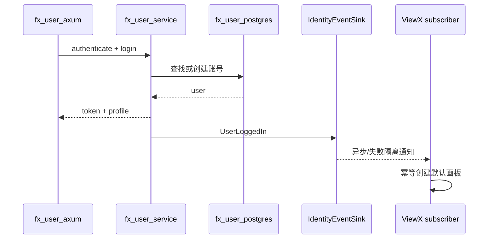
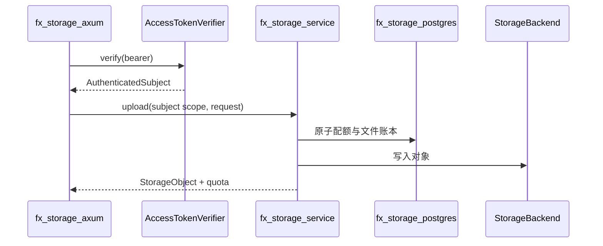
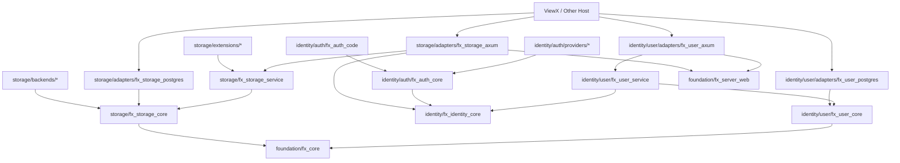

# FrameworkX SDK Foundation — 服务端设计报告

> 关联设计：[客户端设计](../client/design.md) | [边界分析](../analysis.md)

## 1. 目标

- 将认证、用户和存储基础设施变成可独立版本化的 Rust crates；
- 分离领域核心、应用服务、数据库适配器和 Axum 适配器；
- 让身份与存储通过稳定主体契约协作，而不是存储依赖具体用户服务；
- 让迁移文件跟随拥有数据结构的 PostgreSQL 适配器；
- ViewX 只保留配置组装、产品事件、画板引用和产品 API 扩展。

## 2. 现状

认证 Provider 已按独立 crate 拆分，整体适合迁移。`fx_user` 仍把 model、service、PostgreSQL、Axum 放在一起；ViewX 宿主还实现了直接查询认证表的 `PgPasswordStore`。

存储核心的分层优于用户模块：`fx_storage_core`、`fx_storage`、本地、OSS、图像、STS 已分离。主要缺口是 PostgreSQL 账本和 Axum 路由仍在宿主中，路由还查询 ViewX 的 `views` 与 `view_asset_refs`。

## 3. 数据所有权与契约

### 3.1 已认证主体

身份域拥有稳定主体类型，供其他 SDK 域消费：

```rust
pub struct AuthenticatedSubject {
    pub account_id: i64,
    pub status: SubjectStatus,
}

pub trait AccessTokenVerifier: Send + Sync {
    fn verify(&self, token: &str) -> Result<AuthenticatedSubject, IdentityError>;
}
```

存储 Axum 适配器只依赖 `ScopeResolver`，默认 `BearerScopeResolver` 负责解析 Header；宿主仅注入 `token → Scope` 闭包，不依赖 `FxUserService`、用户 Repository 或用户数据库表。

### 3.2 身份数据

`fx_user_postgres` 拥有：

- `accounts`；
- `user_profiles`；
- `auth_credentials`；
- `login_logs`；
- `verify_codes`；
- `scan_sessions`。

密码记录查询随 `fx_user_postgres` 迁移，不由宿主实现 SQL。

### 3.3 存储数据

`fx_storage_postgres` 拥有：

- 通用 `file_objects`；
- `storage_quota`；
- 上传幂等与状态字段。

ViewX 保留：

- `view_asset_refs`；
- 对 `views`、画板正文和资产 ID 一致性的校验；
- “资产关联哪些画板”的查询。

FrameworkX 通过可选引用端口支持宿主阻止删除，但不认识 ViewX：

```rust
#[async_trait]
pub trait ObjectUsagePolicy: Send + Sync {
    async fn can_delete(
        &self,
        subject: &AuthenticatedSubject,
        object_id: i64,
    ) -> Result<DeletePermission, StorageError>;
}
```

### 3.4 API 所有权

FrameworkX `fx_storage_axum` 可提供：

- `GET /storage/quota`；
- `POST /storage/upload/*`；
- `GET /storage/files`；
- `GET /storage/files/{id}`；
- `GET /storage/files/{id}/content`；
- `DELETE /storage/files/{id}`。

ViewX 扩展接口负责：

- 返回 ViewX 画板引用详情；
- 在画板写入时验证资产归属；
- 将通用资产 DTO 组合成 ViewX 页面所需响应。

路径前缀必须可配置，SDK 不假设宿主一定使用 `/storage`。

## 4. 核心流程

### 4.1 认证登录与宿主业务事件



创建账号事务内必须保证账号和认证凭据一致；创建默认画板不是该事务的一部分，也不得导致登录失败。

### 4.2 存储请求授权



## 5. 项目结构与技术决策

### 5.1 服务端 Workspace 结构

服务端采用“**领域目录 → 能力分组 → 独立 crate**”三级组织。目录表达业务归属，`Cargo.toml` 中的 package name 保持完整的 `fx_*` 名称，避免打开多个 `core`、`service` 目录后无法辨认所属模块。

```text
server/
├── Cargo.toml                         # Workspace 成员、公共依赖与统一 lint
├── Cargo.lock                         # SDK Workspace 的可复现依赖锁
├── rust-toolchain.toml                # Rust 工具链版本
├── crates/
│   ├── foundation/                    # 无业务语义的跨域基础能力
│   │   ├── fx_core/                   # 统一错误、结果和通用值对象
│   │   └── fx_server_web/             # HTTP 响应信封等 Web 公共契约
│   │
│   ├── identity/                      # 身份、认证与用户账号域
│   │   ├── fx_identity_core/          # 已认证主体、Token 验证端口、身份错误
│   │   ├── auth/
│   │   │   ├── fx_auth_core/          # AuthProvider 和认证输入输出契约
│   │   │   ├── fx_auth_code/          # 验证码生成、校验、场景与存储端口
│   │   │   └── providers/             # 可按宿主配置选择的认证实现
│   │   │       ├── fx_auth_apple/
│   │   │       ├── fx_auth_email/
│   │   │       ├── fx_auth_github/
│   │   │       ├── fx_auth_google/
│   │   │       ├── fx_auth_password/
│   │   │       └── fx_auth_sms/
│   │   └── user/
│   │       ├── fx_user_core/           # 用户模型、Repository 与事件端口
│   │       ├── fx_user_service/        # 登录、绑定、资料、安全操作用例
│   │       └── adapters/
│   │           ├── fx_user_postgres/   # Repository、密码记录和自有 migrations
│   │           └── fx_user_axum/       # Router、请求 DTO 与响应映射
│   │
│   └── storage/                       # 文件、对象存储、额度与上传域
│       ├── fx_storage_core/           # 对象、Scope、错误和 StorageBackend
│       ├── fx_storage_service/        # 上传、下载、配额和删除用例
│       ├── adapters/
│       │   ├── fx_storage_postgres/   # 文件账本、额度和自有 migrations
│       │   └── fx_storage_axum/       # 通用文件 HTTP API
│       ├── backends/
│       │   ├── fx_storage_local/      # 本地文件系统后端
│       │   └── fx_storage_oss/        # S3 兼容/阿里云 OSS 后端
│       └── extensions/
│           ├── fx_storage_image/      # 图像元数据与缩略图处理
│           └── fx_storage_sts/        # 阿里云临时上传凭据签发
│
├── contracts-tests/                   # 跨 crate 公共契约与兼容性测试
│   ├── identity/                      # Provider、Repository、Token 行为契约
│   └── storage/                       # Backend、账本、配额行为契约
└── examples/
    └── axum-host/                     # 最小宿主示例，只演示组装，不承载业务
```

目录只在出现实际文件时创建，不预先堆放空文件夹。`providers`、`adapters`、`backends` 和 `extensions` 只承担分类作用，不作为 Cargo package。

### 5.2 单个 crate 的内部结构

每个 crate 优先保持标准 Rust 结构。只有职责真实增长后才拆文件，不把同一用例机械拆成 `domain/application/infrastructure` 多层空目录。

```text
fx_user_postgres/
├── Cargo.toml
├── README.md                 # 职责、公开入口、依赖与迁移使用方式
├── migrations/              # 该适配器拥有的数据结构，只允许向前演进
│   ├── 0001_user.sql
│   └── 0002_verification.sql
├── src/
│   ├── lib.rs               # 唯一公开出口
│   ├── repository.rs        # UserRepository 实现
│   ├── password_store.rs    # PasswordRecordStore 实现
│   └── rows.rs              # 私有数据库行映射
└── tests/
    └── postgres_contract.rs # 使用临时数据库执行适配器契约测试
```

维护规则：

- `lib.rs` 是 crate 的公开边界；未导出的实现视为私有。
- `migrations/` 跟随拥有表结构的 PostgreSQL crate，不放在 FrameworkX 根目录，也不放在 Axum crate。
- 单元测试与源码同目录，黑盒契约测试放 crate 的 `tests/`；多个实现共享的测试夹具放 `contracts-tests/`。
- Provider 一个 crate 对应一种外部认证能力，避免 Apple、GitHub、邮件配置相互污染。
- Axum crate 只做 HTTP 提取、DTO 映射和状态码映射，不拼 SQL、不实现领域规则。
- PostgreSQL crate 只实现端口和事务，不依赖 Axum。
- `examples/axum-host` 只证明 SDK 可组装，不复制 ViewX 的环境配置与产品初始化。

### 5.3 Workspace 成员维护

根 `Cargo.toml` 使用显式分组通配，允许同域增加 crate，同时避免把 `examples` 或临时目录误纳入发布包：

```toml
[workspace]
resolver = "2"
members = [
  "crates/foundation/*",
  "crates/identity/fx_identity_core",
  "crates/identity/auth/fx_auth_core",
  "crates/identity/auth/fx_auth_code",
  "crates/identity/auth/providers/*",
  "crates/identity/user/fx_user_core",
  "crates/identity/user/fx_user_service",
  "crates/identity/user/adapters/*",
  "crates/storage/fx_storage_core",
  "crates/storage/fx_storage_service",
  "crates/storage/adapters/*",
  "crates/storage/backends/*",
  "crates/storage/extensions/*",
  "examples/axum-host",
]
```

公共第三方版本、edition、license、repository 和 lint 统一放在 `[workspace.package]`、`[workspace.dependencies]` 与 `[workspace.lints]`。子 crate 使用 `dependency.workspace = true`，不各自维护同一依赖的版本。

### 5.4 职责与依赖方向



禁止的依赖方向：

- `foundation` 不得依赖 `identity` 或 `storage`；
- `identity` 与 `storage` 的领域核心不得互相依赖；
- `core`/`service` 不得依赖 Axum、SQLx、具体云厂商或宿主代码；
- PostgreSQL adapter 与 Axum adapter 不得互相依赖；
- FrameworkX 任意 crate 不得依赖 ViewX；
- 宿主业务事件通过端口或组装层接入，不进入 SDK 的领域模型。

### 5.5 技术决策

| 决策 | 方案 | 理由 |
| --- | --- | --- |
| 顶层按领域分组 | `foundation`、`identity`、`storage` | 查找和演进围绕业务能力，而不是围绕数据库或 Web 框架。 |
| crate 保留完整名称 | 目录继续使用 `fx_user_core` 等名称 | Cargo 日志、IDE 搜索和发布包名能直接对应，避免多个同名 `core`。 |
| 适配器归入所属领域 | 每个域内设 `adapters/` | PostgreSQL/Axum 是领域端口实现，不是全局共享层。 |
| 存储实现分类 | `backends/` 与 `extensions/` 分开 | 文件承载后端和图像/STS 附加能力的生命周期、依赖重量不同。 |
| migrations 随 PostgreSQL crate | `*/adapters/*_postgres/migrations` | 数据结构与所有者同版本发布，宿主不再复制公共表迁移。 |
| 契约测试集中复用 | `contracts-tests/{domain}` | 多个 adapter 使用同一行为测试，同时保留各 crate 黑盒测试。 |
| 身份主体独立 | `fx_identity_core` | 存储需要认证主体，但不应依赖用户业务。 |
| 用户服务拆四层 | core/service/postgres/axum | 当前已经有多个宿主目标，物理隔离能约束依赖。 |
| 存储 PostgreSQL 进入 SDK | 独立 `fx_storage_postgres` | 数据结构和存储服务语义共同演进。 |
| ViewX 引用表不迁 | 宿主实现 usage policy | 避免 SDK 认识画板。 |
| 业务 Hook 改事件出口 | `IdentityEventSink` | 产品初始化失败不应阻断登录。 |
| 不新增第三方依赖 | 复用当前 workspace 依赖 | 本阶段不需要新的技术选型。 |

### 5.6 第三方依赖管理

本次只调整目录和 crate 边界，不新增第三方库。现有 Axum、SQLx、Serde、Tokio、AWS SDK 等依赖统一提升到 workspace 管理；具体版本在迁移实施时从当前锁文件继承，不在设计阶段无依据升级。

### 5.7 SQL 与数据库迁移维护

数据库迁移遵循“**领域拥有、宿主编排、领域内有序、历史只读、只向前演进**”的原则。

#### 所有权

| 数据结构 | Migration 所有者 |
| --- | --- |
| `accounts`、`user_profiles`、`auth_credentials`、`login_logs` | `fx_user_postgres` |
| `verify_codes`、`scan_sessions` | 身份域 PostgreSQL adapter |
| `file_objects`、`storage_quota`、上传幂等状态 | `fx_storage_postgres` |
| `views`、`view_changes`、`view_revisions` | ViewX |
| `view_asset_refs` 及画板资源一致性约束 | ViewX |

跨域外键不改变所有权。`view_asset_refs` 即使引用 `file_objects`，仍表达 ViewX 的画板业务关系，因此由 ViewX migration 维护。

#### 文件编号

FrameworkX 与各产品分别维护自己的编号空间，均可从 `001` 开始；迁移账本使用
`source + filename` 作为唯一键，不把 SDK 的内部迁移数量泄漏给消费方：

```text
frameworkx/001_fx_user.sql
frameworkx/002_fx_user_scan.sql
viewx/001_view_sync.sql
viewx/002_app_services.sql
```

编号只保证同一来源内部的执行顺序。发布后不得重命名、修改内容或复用编号。

#### 执行边界

FrameworkX 在 `server/migrations/postgres` 提供稳定聚合入口；统一迁移工具按依赖顺序显式执行：

```text
identity migrations
        ↓
storage migrations
        ↓
ViewX product migrations
        ↓
ViewX cross-domain migrations
```

Repository、Router 和应用启动构造函数不得隐式执行 migration。生产部署使用独立迁移命令；应用启动时只允许检查数据库版本兼容性。

FrameworkX 后续提供 `tools/fx_migrate`：

```text
fx_migrate plan       # 展示待执行项，不修改数据库
fx_migrate status     # 展示当前版本与兼容性
fx_migrate apply      # 获取数据库 advisory lock 后顺序执行
```

#### 演进策略

- 生产环境只做 forward migration，不依赖 down migration 回滚。
- 破坏性变更采用 `Expand → Backfill → Switch → Contract` 多阶段演进。
- 大规模数据回填使用可观察、可恢复的维护任务；migration 只承担必要结构变化和小规模确定性转换。
- `migrations/` 只保存表、字段、索引、约束和必要转换；测试数据进入 `fixtures/`，开发演示数据进入 `seeds/`。
- 默认用户、验证码、默认画板等运行数据不得写入公共 SDK migration。
- `IF NOT EXISTS` 仅用于 PostgreSQL extension 等确实需要兼容安装状态的对象，不用于掩盖普通表结构漂移。

#### 验证

每次发布必须验证：

1. 空数据库可以迁移到最新版本；
2. 上一个正式 SDK 版本可以升级到最新版本；
3. FrameworkX migration 完成后 ViewX migration 可以继续执行；
4. 已发布 migration 的 SQLx checksum 没有变化；
5. 外键、唯一约束、索引和事务行为符合领域规则；
6. 中途失败不会留下已标记成功但结构不完整的版本；
7. migration 列表不存在重复版本号和重复建表。

## 6. 迁移兼容策略

1. FrameworkX 先建立 crates、workspace 和契约测试，但不改变 ViewX 依赖。
2. 迁移纯核心 crate，保留公开类型和序列化字段兼容。
3. 迁移 PostgreSQL 适配器及 migrations，ViewX 暂时通过 path dependency 验证。
4. 迁移 Axum 适配器，ViewX 用组合路由替换宿主重复实现。
5. 将 ViewX 专属查询拆为路由扩展和 usage policy。
6. 运行认证链、账户操作链、存储上传/删除链与 ViewX 回归测试。
7. 发布固定版本，ViewX 切换版本依赖；确认后删除旧权威副本。

迁移期间禁止双写两份实现。每个包以一次原子切换确定新的权威来源。

## 7. 验收标准

| 验收条件 | 验收方式 |
| --- | --- |
| 核心 crates 不依赖 Axum、SQLx 或 ViewX | `cargo tree` 与源码依赖扫描。 |
| PostgreSQL 和 Axum 可独立替换 | 使用内存 Fake 完成 service 单元测试。 |
| 存储不依赖具体用户模块 | 检查 Cargo 依赖只指向身份主体契约。 |
| 默认画板失败不影响登录 | 注入失败事件消费者执行登录测试。 |
| migrations 有唯一所有者且无重复建表 | 在空库和升级库执行迁移测试。 |
| ViewX 认证、绑定、找回、注销全部兼容 | 真实 HTTP link tests。 |
| 文件上传、配额、列表、内容读取、删除兼容 | 存储 API link tests。 |

## 8. 暂不实现

| 功能 | 理由 |
| --- | --- |
| 立即迁移生产代码 | 等待本设计确认。 |
| 多租户组织与 RBAC | 当前主体只有账号级需求。 |
| 云盘协作分享 | 属于上层产品能力。 |
| ViewX 画板引用模型进入 SDK | 明确违反宿主边界。 |
| 替换现有 JWT、Axum、SQLx 技术栈 | 当前目标是解耦和迁移，不是技术重写。 |
